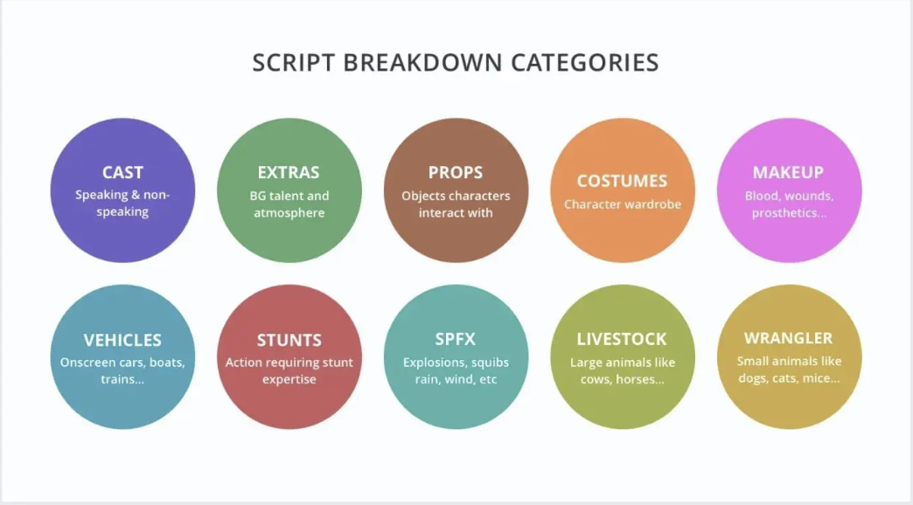
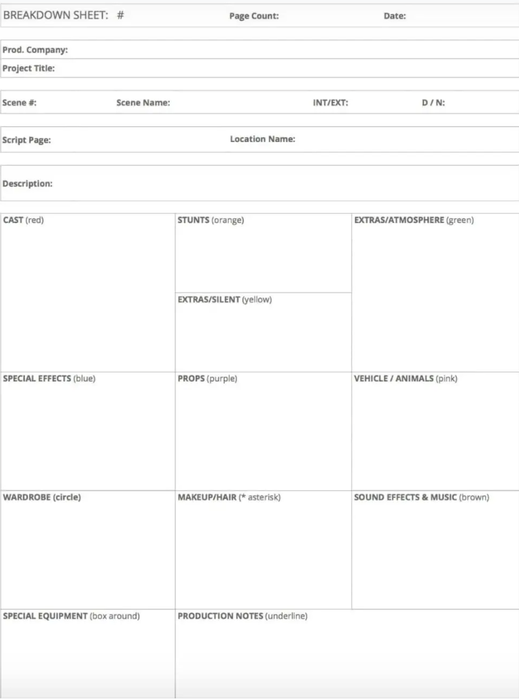
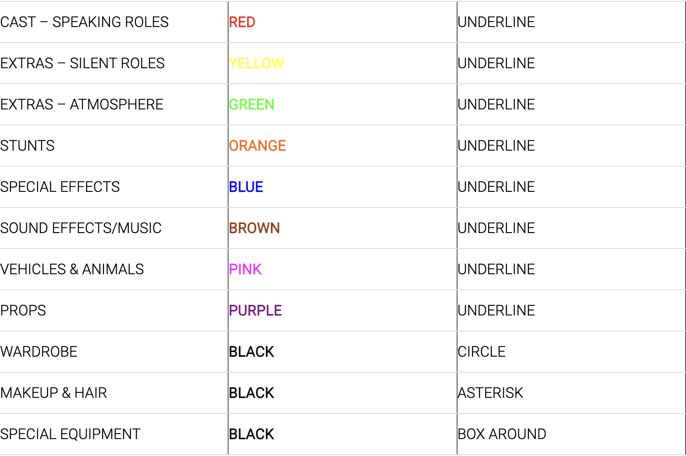
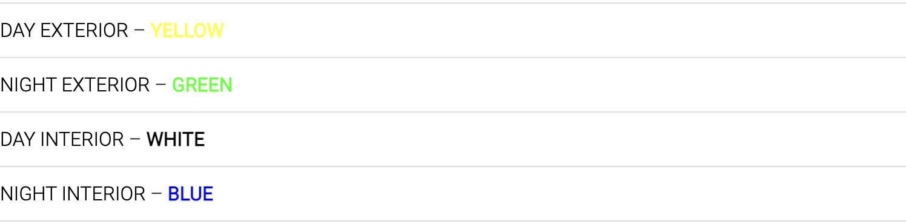

# Day 3 Notes

## Thinking like a line producer

### How To Do A Script Breakdown
https://www.thefilmfund.co/how-to-do-a-script-breakdown/

* The script breakdown is a crucial pre-production step for determining your film’s budget and production schedule
    * you will be breaking down each scene, marking important elements required for the shoot.

* Split the script into 8ths. Generally, one page of your script equals one minute of screentime. 

* Mark all the important elements on the page
    * 

* Once all is marked put it into a script breakdown template
    * 

* Here is the color formatting for script breakdowns
    * 
    * 
---

## AI: How to build an AI that can identify script elements

### How to use machine learning to find synonyms
https://medium.com/@nikhilbd/how-to-use-machine-learning-to-find-synonyms-6380c0c6106b

* I thought this article was interesting in terms of using machine learning to learn similarities between words. Maybe that could be applied?

* Has some cool info on using word embeddings to find synonyms

### alexc-hollywood/screenplay-parser
https://github.com/alexc-hollywood/screenplay-parser

* Parse different types of script files to compile initial lists of scenes, characters, and props.
    * Lists that can be copied and pasted into a breakdown very easily

### ppapalampidi/SUMMER
https://github.com/ppapalampidi/SUMMER

* summarize screenplays by taking into account their underlying narrative structure. 

### drwiner/ScreenPy
https://github.com/drwiner/ScreenPy

* Parse and annotate screenplays with markup language
* Parses into 4 elements
    * Shot headings, Direction, Dialogue, and Transitions
---
So far it seems like the screenplay-parser is the one to use. I would also explore ScreenPy

---
The screenplay/parser
* it can only parse certain types of files, not .pdfs or .txts
* it doesn't parse props correctly. It is good with characters and locations and scenes.

* it looks pretty broken except for the scenes and characters

